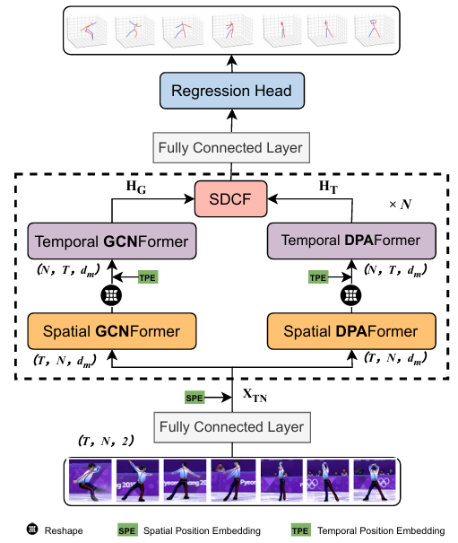
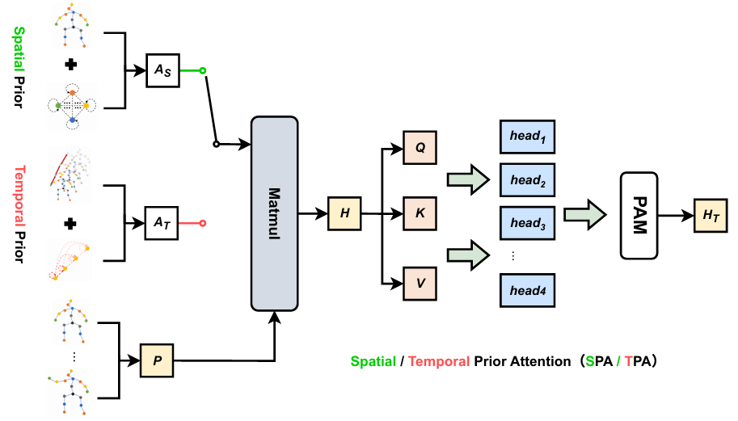
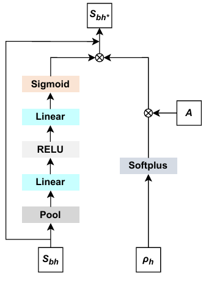
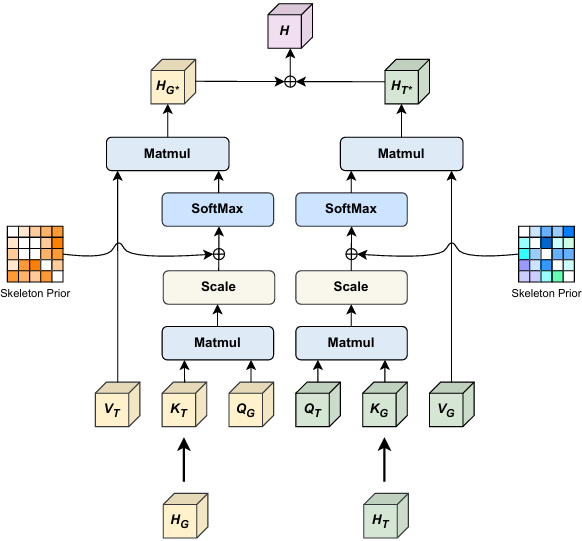

# DSTPFormer: Dynamic Spatial–Temporal Prior Learning for 3D Human Pose Estimation

## Abstract

Transformer and graph convolution-based methods have achieved remarkable progress in video-based 3D human pose estimation. However, existing approaches generally lack explicit constraints on human skeletal structure during feature fusion and make limited use of prior knowledge such as human kinematics and temporal motion continuity. To address these limitations, we propose a dual-branch Dynamic Spatiotemporal Prior-enhanced Transformer (DSTPFormer), which integrates the complementary strengths of GCNFormer and DPAFormer within a unified framework. Specifically, in the DPAFormer branch, we design two prior-aware attention modules: Spatial Prior Attention (SPA) and Temporal Prior Attention (TPA).SPA leverages human anatomical structure to guide spatial dependency modeling, while TPA exploits motion trajectory priors to enhance temporal feature learning. By embedding these priors into the multi-head self-attention mechanism, the proposed modules facilitate more effective modeling of long-range dependencies and discriminative pose representations. To further improve adaptability, we develop a Prior Adaptive Modulation (PAM) mechanism dynamically regulates and selectively enhances the contribution of prior knowledge.To strengthen cross-branch feature interaction, we propose a Structure-aware Dual-directional Cross Fusion (SDCF) module, which introduces a learnable skeletal graph structure between the graph convolution branch and the Transformer branches, thereby improving the structural consistency of pose prediction. Furthermore, the proposed SPA and TPA modules adopt a plug-and-play design, enabling seamless integration into various Transformer-based network architectures, including diffusion models, with minimal computational overhead. Extensive experiments on the Human3.6M and MPI-INF-3DHP benchmark datasets demonstrate that DSTPFormer consistently improves 3D human pose estimation performance and achieves state-of-the-art results under both diffusion-based and non-diffusion settings, validating the effectiveness of incorporating dynamic spatiotemporal priors and structure-aware feature fusion.

---

## Framework Overview

The overall architecture of DSTPFormer is illustrated in **Fig.1**, which shows the complete pipeline of the proposed method.

The framework consists of three main stages:

1. **Feature Embedding**  
   Input 2D pose sequences are first embedded into high-dimensional feature representations.

2. **Dynamic Spatial–Temporal Prior Learning**  
   Spatial and temporal priors are explicitly modeled and dynamically adjusted to guide representation learning.

3. **Transformer-based Pose Decoder**  
   A Transformer backbone aggregates spatial-temporal dependencies and predicts 3D joint coordinates.

The overall design ensures strong structural consistency and temporal stability in 3D pose estimation.

---

## Key Components

### SPA and TPA (Spatial & Temporal Prior Attention)

The Spatial and Temporal Prior Attention mechanisms are illustrated in **Fig.2**.

- **SPA (Spatial Prior Attention)** models structural dependencies among human joints within each frame.
- **TPA (Temporal Prior Attention)** captures motion continuity across consecutive frames.
- These priors enhance both spatial coherence and temporal smoothness.

---

### PAM (Prior Aggregation Module)

The structure of the Prior Aggregation Module (PAM) is shown in **Fig.3**.

- PAM integrates spatial and temporal priors into a unified representation.
- It adaptively balances multiple prior signals.
- Enhances feature consistency across spatial-temporal dimensions.

---

### SDCF (Structure-aware Dynamic Cross Fusion)

The SDCF module is illustrated in **Fig.4**.

- Performs bidirectional cross-fusion between spatial and temporal branches.
- Explicitly encodes human kinematic constraints.
- Strengthens structural consistency in pose estimation.

---

## To-Do List

- [ ] Release training code  
- [ ] Release pretrained models  
- [ ] Add detailed documentation  
- [ ] Provide installation guide  

---

## Installation

Coming soon.

---

## Training

Coming soon.

---

## Evaluation

Coming soon.

---

## License

This project is licensed under the MIT License - see the [LICENSE](LICENSE) file for details.
